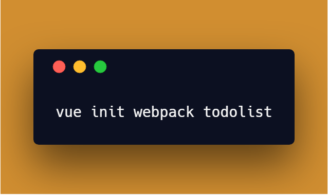

1. vue init webpack frontend

2. create a todolist component in `src/components/` and refer to it in App

3. Create input field

4. Create list of todos in todolist's data ()  

5. Create addTodo method

6. create editTodo,  doneEdit methods,  add completed checkbox

7. Copy components to resources/assets/js/components/ in Laravel

8. add `Vue.component('todo-list', require('./components/TodoList.vue'));` to resources/assets/js/app.js

